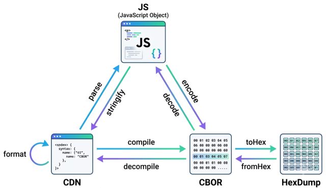

# @cbortech/cbor

[](https://www.npmjs.com/package/@cbortech/cbor)

[](https://bundlejs.com/?q=%40cbortech%2Fcbor)
[](https://www.npmjs.com/package/@cbortech/cbor)
[](./LICENSE)


[CBOR](#準拠している仕様)、[CDN (CBOR-EDN)](#準拠している仕様)、JavaScript 値を相互変換するための TypeScript ライブラリです。



プレイグラウンドを **https://cbor.tech/cbor/** で公開しています。

このパッケージは `CBOR` ファサードに加えて、extension の実装に必要な CBOR AST ノードクラス用の entrypoint を公開します。
低レベルのパーサー、エンコーダー内部は、ドキュメント上の公開 API には含めていません。

## インストール

```bash
npm install @cbortech/cbor
```

コマンドラインでの変換や確認には、CLI パッケージ
[@cbortech/cbor-cli](https://www.npmjs.com/package/@cbortech/cbor-cli) も利用できます。

```bash
npm install -g @cbortech/cbor-cli
```

## インポート

```ts
import { CBOR } from '@cbortech/cbor';
```

default import も利用できます。

```ts
import CBOR from '@cbortech/cbor';
```

## クイック例

### JavaScript から CBOR バイト列へ

```ts
import { CBOR } from '@cbortech/cbor';

const bytes = CBOR.encode({ hello: 'world', n: 42 });

console.log(bytes);
// Uint8Array(...)
```

### CBOR バイト列から JavaScript へ

```ts
import { CBOR } from '@cbortech/cbor';

const value = CBOR.decode(
  new Uint8Array([
    0xa2, 0x65, 0x68, 0x65, 0x6c, 0x6c, 0x6f, 0x65, 0x77, 0x6f, 0x72, 0x6c,
    0x64, 0x61, 0x6e, 0x18, 0x2a,
  ])
);

console.log(value);
// { hello: 'world', n: 42 }
```

### CBOR Sequence から JavaScript へ

`decodeSeq` は連結された CBOR item を CBOR Sequence として読み取り、各 item を JavaScript 値として yield します。

```ts
import { CBOR } from '@cbortech/cbor';

const a = CBOR.encode({ id: 1 });
const b = CBOR.encode({ id: 2 });
const seq = new Uint8Array([...a, ...b]);

const values = [...CBOR.decodeSeq(seq)];
// [{ id: 1 }, { id: 2 }]
```

### CBOR バイト列から CDN へ

`decompile` は CBOR バイト列を CDN テキスト文字列に変換します。CBOR Sequence には自動対応しており、複数 item が連結されている場合は改行区切りの CDN 出力になります。

```ts
import { CBOR } from '@cbortech/cbor';

// 単一 item
const text = CBOR.decompile(new Uint8Array([0x83, 0x01, 0x02, 0x03]));
console.log(text);
// [1,2,3]

// CBOR Sequence — item ごとに 1 行
const seq = new Uint8Array([...CBOR.encode(1), ...CBOR.encode('two')]);
console.log(CBOR.decompile(seq));
// 1
// "two"
```

### CDN から CBOR バイト列へ

`compile` は CDN テキスト文字列を CBOR バイト列に変換します。CDN Sequence（複数 item）を入力すると、CBOR Sequence (RFC 8742) として連結されたバイト列を自動的に出力します。

```ts
import { CBOR } from '@cbortech/cbor';

// 単一 item
const bytes = CBOR.compile('[1, 2, 3]');
console.log(bytes);
// Uint8Array([0x83, 0x01, 0x02, 0x03])

// CDN Sequence — 出力は CBOR Sequence
const seq = CBOR.compile('{"id":1}\n{"id":2}');
console.log([...CBOR.decodeSeq(seq)]);
// [{ id: 1 }, { id: 2 }]
```

### CBOR バイト列から hex dump へ

`toHex` は CBOR バイト列をアノテーション付き hex dump テキストに変換します。CBOR Sequence には自動対応しており、各 item が改行区切りで出力されます。

```ts
import { CBOR } from '@cbortech/cbor';

const bytes = CBOR.encode([1, 2, 3]);
console.log(CBOR.toHex(bytes));
// 83        -- Array of length 3
//    01     -- 1
//    02     -- 2
//    03     -- 3
```

### hex dump から CBOR バイト列へ

`fromHex` はアノテーション付き hex dump を CBOR バイト列に変換します。複数 item のダンプは CBOR Sequence (RFC 8742) として連結されたバイト列を出力します。

```ts
import { CBOR } from '@cbortech/cbor';

const bytes = CBOR.fromHex(`
83        -- Array of length 3
   01     -- 1
   02     -- 2
   03     -- 3
`);
console.log([...CBOR.decodeSeq(bytes)]);
// [[1, 2, 3]]
```

### JavaScript から CDN へ

```ts
import { CBOR } from '@cbortech/cbor';

const text = CBOR.stringify({ a: 1, b: true, c: null });

console.log(text);
// {"a":1,"b":true,"c":null}
```

### 読みやすい CDN を出力する

```ts
import { CBOR } from '@cbortech/cbor';

const text = CBOR.stringify({ items: [1, 2, 3], ok: true }, { indent: 2 });

console.log(text);
// {
//   "items": [
//     1,
//     2,
//     3
//   ],
//   "ok": true
// }
```

### CDN から JavaScript へ

```ts
import { CBOR } from '@cbortech/cbor';

const value = CBOR.parse("[1, h'deadbeef', true, null]");

console.log(value);
// [1, Uint8Array(...), true, null]
```

### CDN Sequence から JavaScript へ

`parseSeq` は複数 item を含む CDN テキスト文字列（空白・カンマ・コメント区切り）をパースし、各 item を JavaScript 値として yield します。JSONL / NDJSON もそのまま扱えます。

```ts
import { CBOR } from '@cbortech/cbor';

const values = [...CBOR.parseSeq('1  "two"  [3]')];
// [1, 'two', [3]]

const jsonl = '{"id":1}\n{"id":2}\n{"id":3}';
const rows = [...CBOR.parseSeq(jsonl)];
// [{ id: 1 }, { id: 2 }, { id: 3 }]
```

### CDN を正規化する

```ts
import { CBOR } from '@cbortech/cbor';

const text = CBOR.format('{ "b" : [ 1,2 ], "a" : true }', { indent: 2 });

console.log(text);
// {
//   "b": [
//     1,
//     2
//   ],
//   "a": true
// }
```

### リーフコンテナを 1 行にまとめる

`inlineLeafContainers` は、要素に配列・マップを含まず（タグで包まれて
いる場合も含みます）、かつすべての要素が改行なしでシリアライズされる
コンテナを 1 行のまま出力します。ネストした
リーフコンテナはそれぞれ個別に 1 行へまとまるため、行列のようなデータが
読みやすくなります。`indent` 指定時に適用されます。

```ts
import { CBOR } from '@cbortech/cbor';

const text = CBOR.format('{"m": [[1,2],[3,4]], "s": (_ "a", "b")}', {
  indent: 2,
  inlineLeafContainers: true,
});

console.log(text);
// {
//   "m": [
//     [1, 2],
//     [3, 4]
//   ],
//   "s": (_ "a", "b")
// }
```

### テキスト文字列を分割して整形する

`splitNewline` を使うと、長いテキスト文字列を改行文字の位置で CDN の文字列連結として
分割できます。このオプションは `indent` を指定したときに適用されます。

```ts
import { CBOR } from '@cbortech/cbor';

const text = CBOR.format('{"text": "line1\\nline2\\nline3"}', {
  indent: 2,
  splitNewline: true,
});

console.log(text);
// {
//   "text": "line1\n" +
//     "line2\n" +
//     "line3"
// }
```

文字列の中身が CDN や JSON 風の内容なら、`splitCdn` で周囲の CDN と同じように
構造に応じた改行とインデントを入れて整形できます。両方のオプションは併用でき、
配列で指定する従来の `textStringFormat` オプションを置き換えます(非推奨)。

```ts
import { CBOR } from '@cbortech/cbor';

const text = CBOR.format('{"cdn": "[1,2,3]"}', {
  indent: 2,
  splitCdn: true,
});

console.log(text);
// {
//   "cdn": "[" +
//       "1," +
//       "2," +
//       "3" +
//     "]"
// }
```

### `+` による文字列連結を保持する

注意: `+` による文字列連結構文は draft-26 で削除されました。この節は legacy
syntax を扱う場合のためのものです。

デフォルトでは、`CBOR.format()` は `+` による文字列連結を 1 つのリテラルに
結合します。`preserveConcatenation` を指定すると、テキスト文字列・バイト文字列とも
元の連結の区切りを保持します。`preserveByteString` を併用すると、バイト文字列の
各パートの元の表記も保持されます。

分割オプションとの関係: 文字列の中身が CDN としてパースできる場合は `splitCdn` が
`preserveConcatenation` より優先されます。`splitNewline` は共存し、保持した各パートに
改行文字が含まれていればさらにそこで分割します。

```ts
import { CBOR } from '@cbortech/cbor';

CBOR.format('"a" + "b"');
// '"ab"'

CBOR.format('"a" + "b"', { preserveConcatenation: true });
// '"a" + "b"'

CBOR.format("h'68' + b64'aQ'", {
  preserveConcatenation: true,
  preserveByteString: true,
});
// "h'68' + b64'aQ'"
```

## AST を扱う

`CBOR.fromCBOR()`、`CBOR.fromCDN()`、`CBOR.fromJS()` は CBOR item を返します。
`CborTextString`、`CborByteString`、`CborArray`、`CborTag` などの具体的なノードクラスは、
extension 向けに `@cbortech/cbor/ast` から export されています。すべての item は次のメソッドを持ちます。

```ts
import { CBOR } from '@cbortech/cbor';
import { CborItem } from '@cbortech/cbor/ast';

const item = CBOR.fromCDN('{ "x": 1 }');
item satisfies CborItem;

const bytes = item.toCBOR();
const text = item.toCDN();
const value = item.toJS();
```

### AST としてパースしてからシリアライズする

```ts
import { CBOR } from '@cbortech/cbor';

const item = CBOR.fromCDN('[_ 1, 2, 3]');

console.log(item.toCDN());
// [_ 1,2,3]

console.log(item.toCBOR());
// Uint8Array(...)
```

### CBOR を AST としてデコードし、CDN として確認する

```ts
import { CBOR } from '@cbortech/cbor';

const item = CBOR.fromCBOR(new Uint8Array([0x83, 0x01, 0x02, 0x03]));

console.log(item.toCDN());
// [1,2,3]

console.log(item.toJS());
// [1, 2, 3]
```

## JSON に近い API

`CBOR.parse()` と `CBOR.stringify()` は、`JSON.parse()` と `JSON.stringify()` に近い感覚で使えるようにしています。

JSON と違い、CBOR では `undefined` も値として表現できます。
reviver や replacer で object entry や map entry を明示的に取り除きたい場合は、
`undefined` を返す代わりに `CBOR.OMIT` を使います。

### Reviver 関数

```ts
import { CBOR } from '@cbortech/cbor';

const value = CBOR.parse(
  '{"createdAt": "2026-05-06T00:00:00Z"}',
  (key, value) => {
    if (key === 'createdAt') return new Date(value);
    return value;
  }
);

console.log(value);
// { createdAt: 2026-05-06T00:00:00.000Z }
```

### Replacer 関数

```ts
import { CBOR } from '@cbortech/cbor';

const text = CBOR.stringify({ id: 1, password: 'secret' }, (key, value) =>
  key === 'password' ? CBOR.OMIT : value
);

console.log(text);
// {"id":1}
```

### Replacer のキー一覧

```ts
import { CBOR } from '@cbortech/cbor';

const text = CBOR.stringify(
  { id: 1, name: 'Alice', password: 'secret' },
  ['id', 'name'],
  2
);

console.log(text);
// {
//   "id": 1,
//   "name": "Alice"
// }
```

## デフォルトオプション

同じオプションを繰り返し使いたい場合は、`CBOR` インスタンスを作成します。

```ts
import { CBOR } from '@cbortech/cbor';

const cbor = new CBOR({
  extensions: [CBOR.dt_as_Date],
  indent: 2,
});

const value = cbor.parse("DT'2026-05-06T00:00:00Z'");

console.log(value);
// Date(...)

console.log(cbor.stringify({ value }));
// {
//   "value": DT'2026-05-06T00:00:00Z'
// }
```

## 日時

CDN の `dt'...'` と `DT'...'` リテラルは、デフォルトでパースできます。
JavaScript の `Date` オブジェクトとして扱いたい場合は `CBOR.dt_as_Date` を追加します。

```ts
import { CBOR } from '@cbortech/cbor';

const value = CBOR.parse("DT'2026-05-06T00:00:00Z'", {
  extensions: [CBOR.dt_as_Date],
});

console.log(value instanceof Date);
// true
```

```ts
import { CBOR } from '@cbortech/cbor';

const text = CBOR.stringify(new Date('2026-05-06T00:00:00Z'), {
  extensions: [CBOR.dt_as_Date],
});

console.log(text);
// DT'2026-05-06T00:00:00Z'
```

## 文字列連結と不定長文字列

draft-ietf-cbor-edn-literals-26(§3.4 / §3.5)の application extension
`t1` / `b1` / `ilbs` / `ilts` は、デフォルトで有効です。

`t1<<...>>` と `b1<<...>>` は、(テキストまたはバイト)文字列の引数を左から
右へ結合し、1 つのテキスト文字列(`t1`)またはバイト文字列(`b1`)を
作ります。引数には省略記号(`...`)も使えます。

```ts
import { CBOR } from '@cbortech/cbor';

const text = CBOR.fromCDN('t1<<"Hello ", "world">>');
console.log(text.toCDN({ appStrings: false }));
// "Hello world"

const bytes = CBOR.fromCDN("b1<<'Hello ', h'776f726c64'>>");
console.log(bytes.toCDN({ appStrings: false }));
// 'Hello world'
```

`ilbs<<...>>` / `ilts<<...>>` は、引数 1 つにつき 1 チャンクの不定長
バイト列/テキスト文字列を作ります。各引数のエンコーディング指示子は
チャンクに引き継がれます。draft-26 で非推奨となった `(_ chunk, ...)`
streamstring 構文の置き換えですが、本ライブラリは従来構文の入力も
引き続き受理します。

```ts
import { CBOR } from '@cbortech/cbor';

const v = CBOR.fromCDN("ilbs<<'Hello ', 'world'>>");
console.log(v.toCDN({ appStrings: false }));
// (_ 'Hello ','world')
```

> [!NOTE]
> `t1` / `b1` という識別子は draft-26 で暫定(provisional)と明記されて
> おり、CBOR ワーキンググループにより改名される可能性があります。

## float

16 進数のビットパターンを IEEE 754 浮動小数点値として解釈します
(draft-ietf-cbor-edn-literals-26 §3.7)。デフォルトで有効です。

```ts
import { CBOR } from '@cbortech/cbor';

const v = CBOR.fromCDN("float'7e00'");
console.log(v.toCDN({ appStrings: false }));
// NaN

// バイト列から解釈する場合
const v2 = CBOR.fromCDN("float<<h'3f800000'>>");
console.log(v2.toCDN({ appStrings: false }));
// 1.0_2
```

## オプション extension

このパッケージには、デフォルト有効ではないものの本体に同梱されている
extension があります。必要なものを `import` し、
`extensions` オプションに渡して使います。

### b32 / h32

[RFC 4648](https://www.rfc-editor.org/rfc/rfc4648) の Base32 エンコードによるバイト列リテラルです。
[RFC 8949](https://www.rfc-editor.org/rfc/rfc8949) §8 に記載があり、[draft-ietf-cbor-edn-literals](https://datatracker.ietf.org/doc/draft-ietf-cbor-edn-literals/25/) でも触れられています。

- `b32` — §6 Base32（`A–Z 2–7` アルファベット）
- `h32` — §7 Base32Hex（`0–9 A–V` アルファベット）

```ts
import { CBOR, b32, h32 } from '@cbortech/cbor';

const v1 = CBOR.fromCDN("b32'AEBAGBA'", { extensions: [b32] });
console.log(v1.toCDN({ appStrings: false }));
// h'01020304'

const v2 = CBOR.fromCDN("h32'00P00'", { extensions: [h32] });
console.log(v2.toCDN({ appStrings: false }));
// h'003200'
```

### same

`same<<expr, expr, ...>>` は、シーケンス内のすべての要素が同一の CBOR
バイト列になることを検証し、最初の要素を返す extension です。
[draft-bormann-cbor-edn-app-ext](https://datatracker.ietf.org/doc/draft-bormann-cbor-edn-app-ext/)
に記載があります。

```ts
import { CBOR, same } from '@cbortech/cbor';

// すべての要素が同じバイト列かを検証し、最初の要素を返す
const v = CBOR.fromCDN("same<<h'0102', h'0102'>>", { extensions: [same] });
console.log(v.toCDN({ appStrings: false }));
// h'0102'

// 要素が 1 つでも有効（常にパスする）
const v2 = CBOR.fromCDN('same<<42>>', { extensions: [same] });
console.log(v2.toCDN({ appStrings: false }));
// 42
```

---

追加の application extension は別パッケージとして公開されています。必要なものを
インストールし、`extensions` オプションに渡して使います。

### hash

`hash` は [draft-ietf-cbor-edn-literals](https://datatracker.ietf.org/doc/draft-ietf-cbor-edn-literals/25/) §3.3 で定義された標準の application extension です。
ハッシュアルゴリズムと値を `hash'algorithm:value'` の形式で表現します。
実装には外部の暗号ライブラリが必要なため、[@cbortech/hash-extension](https://www.npmjs.com/package/@cbortech/hash-extension) として
別パッケージで提供しています。

```bash
npm install @cbortech/hash-extension
```

```ts
import { CBOR } from '@cbortech/cbor';
import { hash } from '@cbortech/hash-extension';

const cbor = new CBOR({ extensions: [hash] });

const digest = cbor.parse(
  "hash'sha-256:47DEQpj8HBSa+/TImW+5JCeuQeRkm5NMpJWZG3hSuFU='"
);
// Uint8Array(32) [227, 176, 196, 66, 152, 252, 28, 20, 154, 251, 244, 200,
//                 153, 111, 185, 36, 39, 174, 65, 228, 100, 155, 147, 76,
//                 164, 149, 153, 27, 120, 82, 184, 85]
```

### uuid

`uuid` はこのライブラリ独自の application extension です。
[@cbortech/uuid-extension](https://www.npmjs.com/package/@cbortech/uuid-extension) として別パッケージで提供しています。

```bash
npm install @cbortech/uuid-extension
```

```ts
import { CBOR } from '@cbortech/cbor';
import { uuid } from '@cbortech/uuid-extension';

const cbor = new CBOR({ extensions: [uuid] });

const id = cbor.parse("uuid'550e8400-e29b-41d4-a716-446655440000'");
// Uint8Array(16) [85, 14, 132, 0, 226, 155, 65, 212, 167, 22, 68, 102, 85, 68, 0, 0]
```

### set / map

`SET` と `MAP` は、タグ付きの Set / Map 値を扱うための、このライブラリ独自の
application extension です。
[@cbortech/set-map-extensions](https://www.npmjs.com/package/@cbortech/set-map-extensions)
としてまとめて別パッケージで提供しています。`SET<<[...]>>` は配列に CBOR tag
258 を付けた値、`MAP<<{...}>>` は map に CBOR tag 259 を付けた値を生成します。

```bash
npm install @cbortech/set-map-extensions
```

```ts
import { CBOR } from '@cbortech/cbor';
import { set, map } from '@cbortech/set-map-extensions';

const cbor = new CBOR({ extensions: [set, map] });

const roles = cbor.parse('SET<<["admin", "editor"]>>');
// Set { 'admin', 'editor' }

const scores = cbor.parse('MAP<<{"alice": 98, "bob": 72}>>');
// Map { 'alice' => 98, 'bob' => 72 }
```

## タグ

JavaScript 上で CBOR のタグ付き値を扱うには `CBOR.Tag` を使います。

```ts
import { CBOR } from '@cbortech/cbor';

const tagged = CBOR.Tag.set('hello', 42n);
const text = CBOR.stringify(tagged);

console.log(text);
// 42("hello")
```

```ts
import { CBOR } from '@cbortech/cbor';

const value = CBOR.parse('42("hello")');

console.log(CBOR.Tag.get(value));
// 42n

console.log(CBOR.Tag.getValue(value));
// "hello"
```

タグ情報が不要で、中身だけを通常の JavaScript 値として扱いたい場合は
`stripTags: true` を指定できます。

```ts
import { CBOR } from '@cbortech/cbor';

const value = CBOR.parse('42("hello")', { stripTags: true });

console.log(value);
// "hello"
```

## Simple 値

`false`、`true`、`null`、`undefined` 以外の CBOR simple value には `CBOR.Simple` を使います。

```ts
import { CBOR } from '@cbortech/cbor';

const text = CBOR.stringify(new CBOR.Simple(16));

console.log(text);
// simple(16)
```

```ts
import { CBOR } from '@cbortech/cbor';

const value = CBOR.parse('simple(16)');

console.log(value instanceof CBOR.Simple);
// true

console.log(value.value);
// 16
```

## マップ

デフォルトでは、テキストキーだけを持つ CBOR map は通常の JavaScript オブジェクトになります。

```ts
import { CBOR } from '@cbortech/cbor';

const value = CBOR.parse('{"a": 1, "b": 2}');

console.log(value);
// { a: 1, b: 2 }
```

文字列ではないキーや重複キーを保持したい場合は、`mapAs: 'entries'` を使います。

```ts
import { CBOR } from '@cbortech/cbor';

const entries = CBOR.parse('{1: "one", 1: "uno"}', {
  mapAs: 'entries',
});

console.log(entries instanceof CBOR.MapEntries);
// true

console.log(entries);
// [[1, "one"], [1, "uno"]]
```

`CBOR.MapEntries` は `CBOR.stringify()` や `CBOR.encode()` にそのまま渡せます。

```ts
import { CBOR } from '@cbortech/cbor';

const entries = new CBOR.MapEntries([1, 'one'], [1, 'uno']);

console.log(CBOR.stringify(entries));
// {1:"one",1:"uno"}
```

## Hex Dump

`CBOR.toHex()` / `CBOR.fromHex()` がショートカット入口です（[クイック例](#cbor-バイト列から-hex-dump-へ) 参照）。
バイト範囲の取得や再エンコードなど AST レベルの操作が必要な場合は、`item.toHexDump()` / `CBOR.fromHexDump()` を直接使います。

```ts
import { CBOR } from '@cbortech/cbor';

const item = CBOR.fromCDN('[_ 1, [2, 3]]');
const dump = item.toHexDump();

console.log(dump);
// 9F        -- Start indefinite-length array
// ...
```

```ts
import { CBOR } from '@cbortech/cbor';

const item = CBOR.fromHexDump(`
83        -- Array of length 3
   01     -- 1
   02     -- 2
   03     -- 3
`);

console.log(item.toCDN());
// [1,2,3]
```

## トークナイズ

`@cbortech/cbor/cdn` サブパスからは、パーサが使用しているのと同じレキサーを
利用できます。シンタックスハイライターなど、パース挙動と厳密に一致する必要が
あるツール向けです。

```ts
import { tokenize, tokenizeLenient } from '@cbortech/cbor/cdn';

const { tokens, comments } = tokenize('[1, "ab"] # note');
// tokens: [{ type: 'LBRACKET', offset: 0, endOffset: 1, ... }, ...]

const lenient = tokenizeLenient('[1, "ab');
// 例外を投げません: 正常にスキャンできたトークンの後に、スキャン不能な
// 末尾全体を覆う ERROR トークンが 1 つ付き、失敗内容は lenient.error に
// 格納されます。
```

`fromCDN` / `parse` / `tokenize` が投げる構文エラーは `CdnSyntaxError`
(`SyntaxError` のサブクラスで、メインエントリからも export されています)の
インスタンスで、`offset`・`line`・`column`、判明している場合は `endOffset` を
保持します。

## 公開 API

ドキュメント化している公開 export は次のとおりです。

- `CBOR`
- `CdnSyntaxError`

`CBOR` ファサードからは次にもアクセスできます。

- `CBOR.Tag`
- `CBOR.Simple`
- `CBOR.MapEntries`
- `CBOR.dt_as_Date`
- `CBOR.OMIT`

より低レベルの CDN トークナイズ API は `@cbortech/cbor/cdn`
(`tokenize`, `tokenizeLenient`, `Token`, `TokenType`, `EdnComment`)に、
AST ノードクラスは `@cbortech/cbor/ast` にあります。

## 準拠している仕様

このライブラリは次の仕様を対象にしています。

- [CBOR, RFC 8949](https://www.rfc-editor.org/rfc/rfc8949)
- [Concise Diagnostic Notation (CDN), draft-ietf-cbor-edn-literals-25](https://datatracker.ietf.org/doc/draft-ietf-cbor-edn-literals/25/)

draft -25 をベースに、
[draft -26](https://datatracker.ietf.org/doc/draft-ietf-cbor-edn-literals/26/)
の一部仕様も先行して取り込んでいます。

- 文字列連結 extension `t1` / `b1`(§3.4)
- 不定長文字列 extension `ilbs` / `ilts`(§3.5)
- `float` extension のデフォルト有効化(§3.7)
- draft-26 の raw string 規則(§2.5.4): 終端デリミタは開始デリミタと
  同数のバッククォートに限られ、スペース除去規則がすべてのデリミタ長に
  適用されます

draft -26 で削除された `+` による文字列連結構文と、非推奨となった
`(_ ...)` streamstring 構文は、引き続き受理します。CDN は Internet-Draft
として策定中の仕様であり、今後も変更される可能性がある点に注意して
ください(たとえば extension 名 `t1` / `b1` は暫定とされています)。

CDN は、CBOR データを人間が読み書きしやすいテキストとして表現するための記法です。
サンプル、テストベクター、デバッグ、fixture、設定ファイルに近い用途など、CBOR のバイト列をそのまま扱うと読みにくい場面で役立ちます。

通常の配列、マップ、文字列、数値、真偽値、null は JSON に近い見た目で書けます。
一方で、CBOR 固有の byte string、tag、simple value、不定長 item、文字列以外の map key、
`dt'2026-05-06T00:00:00Z'` のような application literal も表現できます。

CDN は JSON / JSONC の上位互換なので、通常の JSON データやコメント付きの JSON 風データも、
特別な変換なしに CDN としてパース・整形できます。

## ライセンス

Apache-2.0
